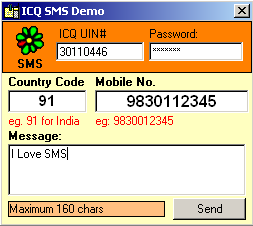

<div align="center">

## ICQSMS Activex Component \(Updated\)


</div>

### Description

For all those developers who want to integrate the Mobile SMS feature in their applications I recently developed an ActiveX dll component in Visual Basic which can send your SMS messages through the ICQ Network from ASP / Visual Basic applications.

I would be glad if you all please do give your valuable feedback and yes don't forget to vote for my code. Till then Happy SMS'ing.
 
### More Info
 
<%

set ICQSMS = CreateObject("ICQSMS.SMS")

ICQSMS.DeveloperName = "Vijay Bhatter"

ICQSMS.DeveloperEmail = "vijay@cyberax.net"

ICQSMS.ResponseTime = 15

'Syntax: 'ICQSMS.SendSMS ICQUIN,Password,CountryCOde,MobileNumber,Message

'eg:

ICQSMS.SendSMS "30110446","xdwswe","91", "9831010101","I love SMS"

set ICQSMS = nothing

%>


----

Installation Procedure

----

1. Compile the code to ICQSMS.dll.

2. Save the above component in your C:\Winnt\System32 folder.

3. Register the dll.

eg. regsvr32 C:\winnt\system32\icqsms.dll

----

Minimum Requirements:

----

To run this application you'll need Microsoft Internet Transfer Control and Visual Basic Runtime dll installed onto your system.

----

Request

----

I would be glad if you all please do give your valuable feedback and yes don't forget to vote for it. Till then Happy SMS'ing.


<span>             |<span>
---                |---
**Submitted On**   |2002-08-14 17:03:36
**By**             |[Vijay Bhatter](https://github.com/Planet-Source-Code/PSCIndex/blob/master/ByAuthor/vijay-bhatter.md)
**Level**          |Intermediate
**User Rating**    |4.1 (29 globes from 7 users)
**Compatibility**  |VB 6\.0, VB Script, ASP \(Active Server Pages\) 
**Category**       |[OLE/ COM/ DCOM/ Active\-X](https://github.com/Planet-Source-Code/PSCIndex/blob/master/ByCategory/ole-com-dcom-active-x__1-29.md)
**World**          |[Visual Basic](https://github.com/Planet-Source-Code/PSCIndex/blob/master/ByWorld/visual-basic.md)
**Archive File**   |[ICQSMS\_Act1179578142002\.zip](https://github.com/Planet-Source-Code/vijay-bhatter-icqsms-activex-component-updated__1-37794/archive/master.zip)

### API Declarations

```
'For VB applications
Dim MySMS As New ICQSMS.SMS
```


